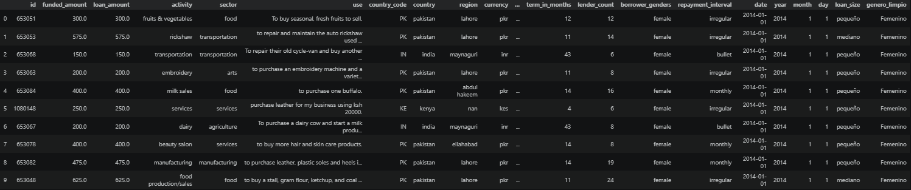
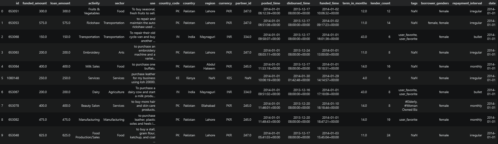

# Proyecto de Limpieza y Preparación de Datos: Kiva Crowdfunding

Este repositorio contiene el flujo de trabajo completo para la limpieza, transformación y estructuración del dataset de microcréditos de **Kiva**. El objetivo principal es convertir datos brutos en un conjunto de datos consistente, optimizado y listo para el análisis profesional.

---

## Tecnologías y Entorno

* **Lenguaje:** Python 3.14.4
* **Librerías principales:** `pandas`, `matplotlib.pyplot`
* **Entorno de desarrollo:** Google Colab / Jupyter Notebooks
* **Editor de código:** Visual Studio Code

---

## Flujo de Trabajo Detallado

### 1. Configuración y Diagnóstico Inicial
Se establece la conexión con el entorno y se realiza una auditoría técnica del estado de los datos:

* **Carga de datos:** Conexión con Google Drive y lectura del archivo `kiva_loans.csv`.
* **Exploración estructural:**
    * `df.shape`: Identificación del volumen de registros y variables.
    * `df.info()` y `df.dtypes`: Verificación de la integridad de los tipos de datos y uso de memoria.
    * `df.describe(include='all')`: Análisis estadístico inicial de variables numéricas y categóricas.
* **Detección de inconsistencias:**
    * `df.duplicated().sum()`: Localización de copias exactas de registros.
    * `df.isnull().sum()`: Identificación de columnas con mayor ausencia de información.

### 2. Limpieza de Datos
Se aplicaron técnicas de depuración para garantizar la calidad de la información:

* **Eliminación de registros:** Supresión de filas duplicadas y registros con valores nulos en columnas críticas como monto y país.
* **Gestión de Ausentes:** Los valores vacíos en variables categóricas se etiquetaron como `"Sin dato"` o `"Sin_informacion"` para evitar errores en agrupaciones futuras.
* **Normalización de Género:** Se procesó la columna `borrower_genders` para extraer únicamente el género principal, eliminando listas complejas y corrigiendo inconsistencias.
* **Estandarización de Texto:** Corrección de mayúsculas, minúsculas y formatos en las columnas: `activity`, `sector`, `country`, `region`, `currency` y `repayment_interval`.
* **Reducción de Dimensionalidad:** Eliminación de la columna `tags` por carecer de relevancia técnica para el análisis planteado.

### 3. Transformaciones y Tipado
Ajuste de la estructura de datos para facilitar operaciones matemáticas y lógicas:

* **Tratamiento de Fechas:** Conversión de columnas temporales a formato `datetime` y creación de variables derivadas: `Año`, `Mes` y `Día`.
* **Optimización de Tipos:**
    * Asignación de formato numérico a `funded_amount` y `loan_amount`.
    * Conversión a enteros (`int`) de `id`, `partner_id`, `term_in_months` y `lender_count`.
* **Tratamiento de Outliers:** Tras una investigación profunda de la distribución, se decidió **conservar los valores atípicos** en los montos de préstamos.
    * **Justificación:** En el contexto global de Kiva, los montos extremos reflejan realidades económicas diversas. Eliminarlos sesgaría el análisis y ocultaría la capacidad financiera real de ciertos países y sectores.

### 4. Ingeniería de Características (Feature Engineering)
Se crearon nuevas dimensiones de análisis mediante la segmentación del monto del préstamo (`loan_amount`):

* **Pequeño:** Hasta 500.
* **Mediano:** De 501 a 2000.
* **Grande:** Superior a 2000.

---

## Resumen de Decisiones Técnicas

| Problema | Acción Realizada | Justificación |
| :--- | :--- | :--- |
| **Duplicados y Nulos Críticos** | Eliminación directa | Garantizar la integridad estadística del dataset. |
| **Géneros Complejos** | Simplificación a primer término | Facilitar la agrupación y visualización por género. |
| **Valores Atípicos (Outliers)** | Identificación y conservación | Mantener la representatividad de diferentes economías regionales. |
| **Variables Categóricas Vacías** | Etiquetado como "Sin dato" | Evitar la pérdida de registros en cruces de variables. |
| **Segmentación de Montos** | Clasificación por rangos | Permitir un análisis cualitativo por capacidad crediticia. |

---

## Resultados del Análisis
El notebook incluye el procesamiento final para obtener:
1.  **Distribución por Sector:** Proporción de créditos otorgados según el área de actividad económica.
2.  **Distribución por Género:** Comparativa del volumen de préstamos tras la normalización de la categoría.
3.  **Paises con mayor cantidad de prestamos:** Comparativa del volumen de prestamos por país.

---

